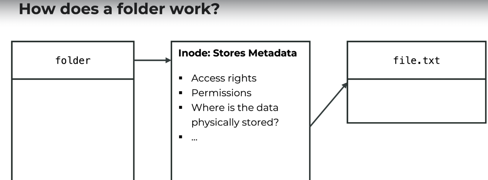

What is a file?

1. A container for storing, accessing or managing data
2. Typically associated with a unique identifier or filename
3. This name is combined with its path, provides a unique location for each file in a file system.

File can have various attributes (stroed in inode):

1. Size: The amount of data stored in the file.
2. Permission: Who can read, write or execute the file.
3. Ownership: Which user or groups owns the file.
4. Timestamp: When the file was created, last accessed or modified.

How is the data stored?
==>

How does folder work?
==>

Files on Linux system:

1. In Linux and Unix like systems, (almost) everything is considered as a file.
2. This is part of unix philosophy.

For example:

1. Ordinary file (-)
2. Directories (d)
3. Symbolic links (l)
4. Character device (c)
5. Block device (b)
6. Named pipes (p)
7. Sockets (s)

We can show the type of the file with ls command

1. ls -l [folder_name / file_name]
2. Then the type will show the first character of the first column.

-rw-rw-r-- 1 mayur mayur 9019 Apr 12 11:46 document.txt

Here, - in the above line will shows up that this is a file type.

---

What is Symlink?
==>

1. A symlink is a special kind of file on Unix Systems
   Purpose:
   A. It serves as a reference to another file or directory.
   B. It is a special way of "shortcut" to another destination.

The idea:

1. We create a special file, that contains a reference to the destination path.
2. This reference is being resolved on access of the symlink (or a file within it)
3. This affects the read and write operations

How to create a symlink?
==>

1. we can use ln -s command for this
2. ln is a tool to make a links between files
3. we can use it to create symlink
   Syntax:
   ln -s target link
   Example:
   ln -s ~/Desktop deskshortcut

To verify:
ls -l
then if the first character is l then this file is a symlink.
lrwrwxrwx

ls -l deskshortcut
lrwxrwxrwx 1 mayur mayur 8 May 15 11:00 deskshortcut -> Desktop/

===

What is Hardlink?
==>

1. A hardlink is a directory entry or reference to an existing inode
2. Technically, first filename of a file is already a hardlink
3. But one file can have multiple hardlinks
   Thus:
   Hardlink beahve as if they were the same file
   A hardlink can only link to files on the same filesystem
   The filesystem must support additional hardlinks

If we delete hardlink:

1. The other filenames/hardlinks remain same intact
2. The data is only deleted if all hardlinks are removed.

How can we create a hardlink?
==> we can use ln command for this (without -s option)
Syntax:
ln target hardlink

example:
ln ~/Desktop deskshardlinked

Limitation of hardlink is : we can not create hardlink on the directories (to prevent loops)

if we change any of the file or update any of the file then original file also get changed automatically, this is the way we can achieve hardlink in the linux.
