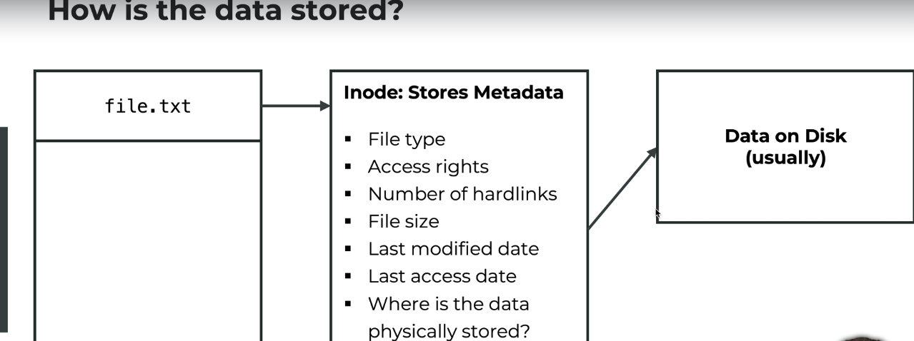

What is a file?

1. A container for storing. accessing or managing data
2. Typically associated with a unique identifier or filename
3. This name is combined with its path, provides a unique location for each file in a file system.

File can have various attributes (stroed in inode):

1. Size: The amount of data stored in the file.
2. Permission: Who can read, write or execute the file.
3. Ownership: Which user or groups owns the file.
4. Timestamp: When the file was created, last accessed or modified.

How is the data stored?
==>

